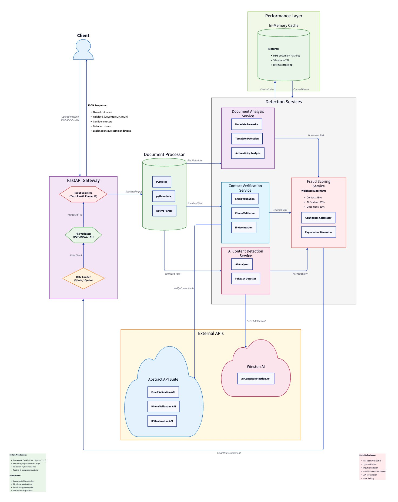

# Resume Fraud Detection System

## Executive Summary

🚀 **Live Demo System**: [https://resume-fraud-api-production.up.railway.app](https://resume-fraud-api-production.up.railway.app)

A Python-based resume fraud detection system that identifies potential signs of fraudulent candidates using **3 detection methods**. The system combines contact verification, AI content detection, and document authenticity analysis with a weighted scoring algorithm.

### Quick Test the Live System
1. **Visit**: [https://resume-fraud-api-production.up.railway.app](https://resume-fraud-api-production.up.railway.app)
2. **Upload**: Any PDF, DOCX, or TXT resume
3. **Analyze**: Get instant fraud risk assessment with detailed breakdown

### Local Setup (5 minutes)
```bash
git clone https://github.com/harveyfullstack/summer-2025-recruitment && cd summer-2025-recruitment
python -m venv venv && source venv/bin/activate
pip install -r requirements.txt
cp .env.example .env  # Add API keys for full functionality
uvicorn app.main:app --reload --port 8000
# Visit: http://localhost:8000
```

**Status**: ✅ **Demo Ready** with real API integrations

---

## Table of Contents

1. [Executive Summary](#executive-summary)
2. [Features Implemented](#features-implemented)
3. [Quick Start](#quick-start)
4. [Project Structure](#project-structure)
5. [Technical Architecture](#technical-architecture)
6. [Performance & Security](#performance--security)
7. [Technology Stack](#technology-stack)
8. [Detection Algorithm Design](#detection-algorithm-design)
9. [Analysis Report](#analysis-report)
10. [Production Deployment](#production-deployment)
11. [API Keys Required](#api-keys-required)

---

## Overview

A Python-based resume fraud detection system built for assessment purposes that identifies potential signs of fraudulent or malicious candidates during the hiring process. This system analyzes resumes using multiple detection techniques to flag suspicious patterns, inconsistencies, and red flags.

**Note**: This is an assessment implementation designed to demonstrate technical capabilities within time constraints. For production use, additional security measures including authentication, authorization, and comprehensive audit logging would be required.

## Features Implemented

This system implements **3 detection mechanisms**:

### 1. Contact Information Verification ✅
- **Email validation** with disposable email detection and quality scoring
- **Phone number validation** with international format support (190+ countries)
- **IP intelligence analysis** with VPN/Proxy/Tor detection and threat scoring
- **Geographic consistency** analysis across contact methods
- **Integration**: Abstract API suite with graceful fallback mechanisms

### 2. AI Content Detection ✅
- **Section-by-section analysis** (summary, experience, skills, education)
- **Professional AI detection** using Winston AI (99.98% claimed accuracy)
- **Confidence scoring** with suspicious section identification
- **Fallback detection** using pattern analysis for offline operation
- **Integration**: Winston AI with intelligent text padding for API requirements

### 3. Document Authenticity Analysis ✅
- **Metadata forensics** for PDF and DOCX files
- **Creation/modification timestamp** analysis for authenticity verification
- **Creator software fingerprinting** to detect template abuse
- **File format support**: PDF, DOCX, and TXT with comprehensive validation
- **Security-minded processing** with size limits and encoding validation

## Quick Start

### 1. Environment Setup

```bash
# Ensure Python 3.11+ is installed
python --version  # Should be 3.11+

# Clone the repository
git clone https://github.com/harveyfullstack/summer-2025-recruitment
cd summer-2025-recruitment

# Create and activate virtual environment
python -m venv venv
source venv/bin/activate  # On Windows: venv\Scripts\activate

# Install dependencies
pip install -r requirements.txt
```

### 2. Configuration

```bash
# Copy environment template
cp .env.example .env

# Edit .env with your API keys
# Required for full functionality:
ABSTRACT_EMAIL_API_KEY=your_email_validation_key_here
ABSTRACT_PHONE_API_KEY=your_phone_validation_key_here  
ABSTRACT_IP_API_KEY=your_ip_geolocation_key_here
WINSTON_AI_API_KEY=your_winston_ai_key_here

# Optional settings:
DEBUG=True
DOCS_ENABLED=True  # Enable API documentation at /docs
```

### 3. Choose Your Setup

**Backend Only** (API development/testing):
```bash
uvicorn app.main:app --reload --port 8000
# API available at: http://localhost:8000
# API docs at: http://localhost:8000/docs (if DOCS_ENABLED=True)
```

**Frontend Only** (demo/presentation):
```bash
# Use production deployment
open https://resume-fraud-api-production.up.railway.app

# Or run locally with production API
uvicorn app.main:app --reload --port 8000
# Visit: http://localhost:8000
```

**Full Development Setup** (integrated frontend + backend):
```bash
# Single command serves both frontend and backend
uvicorn app.main:app --reload --port 8000

# Access everything at: http://localhost:8000
# Frontend interface: http://localhost:8000/
# API endpoints: http://localhost:8000/api/v1/*
# Health check: http://localhost:8000/health
```

**Quick Validation**:
```bash
# Test the system
python test_api.py

# Run comprehensive tests
python run_tests.py
```

### 4. Live Demonstration

**Option A - Integrated Web Interface** (Recommended for presentations):
```bash
# Production deployment (frontend + backend unified)
open https://resume-fraud-api-production.up.railway.app

# Or run locally
uvicorn app.main:app --reload --port 8000
# Visit: http://localhost:8000
```

**Option B - Command Line Demo**:
```bash
python demo.py
```

The integrated web interface provides:
- **Unified Architecture**: Frontend and backend served from single FastAPI application
- **Modular Design**: Frontend (`static/`) and backend (`app/`) remain completely decoupled
- **Easy Separation**: Remove 3 lines from `app/main.py` to deploy as API-only service
- **Interactive API Testing**: Upload files and test all endpoints in real-time
- **Professional Interface**: Clean, responsive design perfect for demonstrations
- **Live Results**: JSON responses with syntax highlighting and performance metrics
- **Sample Files**: Quick-load buttons for immediate testing
- **No CORS Issues**: Same-origin requests for seamless operation

The command line demo provides:
- **Technical Analysis**: Detailed breakdown of weighted algorithm (45%/35%/20%)
- **Comparative Intelligence**: Cross-file pattern analysis and format-based insights
- **API Integration Showcase**: Fallback mechanisms and error handling demonstration
- **Technical Demonstration**: Performance metrics and reliability analysis

### 5. API Usage

The system provides both individual service endpoints and comprehensive fraud detection:

```bash
# Health check
curl http://localhost:8000/health

# Complete fraud detection
curl -X POST "http://localhost:8000/api/v1/detect/resume" \
     -H "Content-Type: multipart/form-data" \
     -F "file=@sample_resume.pdf"

# Individual services
curl -X POST "http://localhost:8000/api/v1/verify/contact" -F "file=@resume.pdf"
curl -X POST "http://localhost:8000/api/v1/analyze/content" -F "file=@resume.pdf"  
curl -X POST "http://localhost:8000/api/v1/examine/document" -F "file=@resume.pdf"
```

## Project Structure

```
app/
├── core/                    # Core utilities and configuration
│   ├── api_error_handler.py # Centralized error handling
│   ├── cache.py            # In-memory caching system
│   ├── config.py           # Environment configuration
│   ├── rate_limiter.py     # API rate limiting
│   ├── sanitizer.py        # Input sanitization
│   └── validation.py       # File and input validation
├── models/
│   └── schemas.py          # Pydantic response models
├── services/               # Business logic modules
│   ├── ai_detection.py     # Winston AI integration
│   ├── contact_verification.py # Abstract API integration
│   ├── document_analysis.py    # Metadata analysis
│   ├── document_processor.py   # PDF/DOCX text extraction
│   └── fraud_scorer.py         # Risk scoring algorithm
└── main.py                 # FastAPI application and routes

static/                     # Frontend assets (optional)
├── index.html             # Web interface
├── style.css              # Styling
├── script.js              # JavaScript

tests/                      # Comprehensive test suite (42 tests)
main.py                     # Railway deployment entry point
railway.json                # Production deployment configuration
requirements.txt            # Python dependencies
demo.py                     # Interactive demonstration
```

### Modular Architecture

**API-Only Deployment** (Original requirement):
```python
# Remove these 3 lines from app/main.py for pure API service:
# app.mount("/static", StaticFiles(directory="static"), name="static")
# @app.get("/")
# async def serve_frontend(): return FileResponse("static/index.html")
```

**Integrated Deployment** (Current setup):
- Frontend and backend remain completely decoupled
- `static/` directory can be served by any web server (nginx, Apache, CDN)
- API endpoints work independently with any frontend framework
- Easy to separate for microservices architecture

## Technical Architecture



### System Design
- **Framework**: FastAPI with async support for high-performance concurrent processing
- **Detection Pipeline**: Modular services with weighted risk scoring algorithm
- **External APIs**: Abstract API suite + Winston AI with intelligent fallback mechanisms
- **Performance**: In-memory caching, rate limiting, and async processing
- **Security**: Input validation, file sanitization, and controlled API documentation

### Weighted Risk Scoring Algorithm

The system uses a weighted scoring approach:

```python
# Risk calculation weights
Contact Verification: 45%    # Highest weight - hard to fake
AI Content Detection: 35%    # High weight - detects modern fraud  
Document Authenticity: 20%   # Supporting weight - metadata analysis

# Risk levels
Low Risk:    0.0 - 0.34 (Green)
Medium Risk: 0.35 - 0.59 (Yellow)  
High Risk:   0.60 - 1.0 (Red)
```

### API Endpoints

| Endpoint | Method | Description | Rate Limit |
|----------|--------|-------------|------------|
| `/health` | GET | System health check | None |
| `/api/v1/detect/resume` | POST | Complete fraud analysis | 5/minute |
| `/api/v1/verify/contact` | POST | Contact verification only | 10/minute |
| `/api/v1/analyze/content` | POST | AI content detection only | 10/minute |
| `/api/v1/examine/document` | POST | Document analysis only | 10/minute |
| `/docs` | GET | Interactive API documentation | None* |

*API documentation requires `DOCS_ENABLED=True` in environment

### Response Format

All detection endpoints return structured JSON with confidence scores:

```json
{
  "overall_risk_score": 0.46,
  "risk_level": "medium", 
  "confidence": 0.83,
  "detected_issues": [
    "Invalid email format detected",
    "Suspicious document metadata"
  ],
  "contact_verification": { "risk_score": 0.8, "confidence": 0.9 },
  "ai_content_analysis": { "overall_ai_probability": 0.02, "confidence": 0.85 },
  "document_analysis": { "risk_score": 0.3, "confidence": 0.7 },
  "analysis_timestamp": "2024-01-15T10:30:00Z"
}
```

## Performance & Security

### Performance Features
- **Async Processing**: Concurrent API calls for faster analysis
- **Intelligent Caching**: 30-minute TTL for repeated document analysis
- **Rate Limiting**: Prevents abuse while ensuring fair usage
- **Fallback Mechanisms**: Graceful degradation when external APIs fail

### Security Implementation
- **Input Validation**: File type, size, and encoding verification
- **Input Sanitization**: Email, phone, IP, and text content cleaning
- **Sanitization**: Secure file processing with automatic cleanup
- **API Security**: Controlled documentation access and rate limiting
- **Privacy Compliance**: In-memory processing with no persistent storage

### Supported File Formats
- **PDF**: Full metadata extraction and text analysis
- **DOCX**: Microsoft Word document processing
- **TXT**: Plain text resume analysis

## Technology Stack

- **Framework**: FastAPI 0.104.1 with async support
- **Document Processing**: PyMuPDF (PDF), python-docx (DOCX)
- **External APIs**: Abstract API suite, Winston AI
- **Performance**: slowapi (rate limiting), in-memory caching
- **Testing**: pytest with 42 comprehensive tests
- **Security**: File validation, input sanitization

## Technical Architecture

### Detection Algorithm Design

#### Weighted Risk Scoring
The system uses a mathematically weighted approach to combine multiple fraud indicators:

```
Overall Risk = (Contact × 0.45) + (AI Content × 0.35) + (Document × 0.20)
```

**Rationale**: Contact verification receives the highest weight (45%) as fake contact information is a common fraud indicator. AI content detection (35%) targets generated resume content. Document analysis (20%) identifies template abuse and metadata anomalies.

#### Contact Information Verification
- **Email validation**: Format validation, deliverability checking, disposable email detection
- **Phone verification**: International format validation, carrier identification, geographic consistency
- **IP intelligence**: VPN/Proxy/Tor detection, threat level analysis, abuse confidence scoring
- **Fallback strategy**: Local validation when APIs unavailable, maintains functionality

#### AI Content Detection
- **Primary**: Winston AI API for professional-grade detection with 300+ character requirements
- **Fallback**: Pattern-based detection using linguistic markers and generic phrase analysis
- **Section analysis**: Resume parsed into summary, experience, skills, education for targeted detection
- **Confidence weighting**: API success rate tracked for proportional confidence calculation

#### Document Authenticity Analysis
- **Metadata forensics**: Creation/modification timestamps, author information, software signatures
- **Template detection**: Generic titles, rapid creation patterns, missing authorship
- **Format analysis**: Suspicious formatting patterns, embedded object analysis

### API Integration Strategy

#### External Service Architecture
- **Abstract API Suite**: Separate keys for email, phone, IP services for granular control
- **Winston AI**: Professional content detection with intelligent text padding for minimum requirements
- **Async processing**: Concurrent API calls with proper timeout and error handling
- **Rate limiting compliance**: Intelligent request pacing to respect API limits

#### Graceful Degradation
- **API failure handling**: Local fallbacks maintain core functionality
- **Confidence adjustment**: Proportional confidence based on actual API success rates
- **Error isolation**: Single API failure doesn't compromise entire analysis

### System Design Decisions

#### Performance Optimization
- **Caching strategy**: MD5-based document hashing for result caching with 30-minute TTL
- **Async pipeline**: Concurrent API calls reduce total processing time
- **Rate limiting**: 5/min for comprehensive analysis, 10/min for individual services

#### Security Implementation
- **File validation**: Size limits (10MB), type restrictions, encoding verification
- **Input sanitization**: Text extraction with encoding fallbacks
- **API key isolation**: Separate configuration for each external service
- **Documentation control**: Production-safe API docs (disabled by default)

### Tool Selection Rationale

#### External API Choices
- **Abstract API Suite**: Fraud detection APIs with coverage for email, phone, and IP verification. Chosen for reliability and separate service granularity.
- **Winston AI**: Professional AI content detection with high accuracy rates. Selected over OpenAI's detector due to better API stability and commercial licensing.
- **FastAPI**: High-performance async framework with automatic OpenAPI documentation. Optimal for API-heavy workloads with concurrent external calls.

#### Architecture Decisions
- **Modular services**: Separate classes for each detection method enable independent testing and maintenance
- **Async processing**: External API calls are I/O bound, async provides significant performance gains
- **Weighted scoring**: Mathematical approach provides consistent, explainable risk assessment
- **Graceful degradation**: System remains functional without external APIs, critical for production reliability

### Known Limitations and Potential Improvements

#### Current Limitations
- **Professional background verification**: No LinkedIn or employment history cross-referencing
- **Digital footprint analysis**: Limited social media presence validation
- **Advanced AI detection**: Relies on Winston AI; no ensemble model approach
- **Document format support**: Limited to PDF, DOCX, TXT (no RTF, ODT, or image-based resumes)
- **Language support**: English-only content analysis and validation
- **Real-time processing**: Synchronous API calls may impact response times under load

#### Potential Improvements
- **Enhanced AI detection**: Combine multiple AI detection services for higher accuracy
- **Professional verification**: Integrate LinkedIn API or employment verification services
- **Advanced document analysis**: OCR support for image-based resumes, deeper metadata forensics
- **Machine learning**: Custom ML models trained on resume fraud patterns
- **Performance optimization**: Redis caching, async queue processing for heavy workloads
- **Security enhancements**: JWT authentication, request signing, audit logging
- **Monitoring**: Comprehensive logging, metrics collection, alerting for production deployment

## Analysis Report

### Implementation Summary

**Detection Methods Implemented**: 3 detection methods
- **Contact Information Verification**: Email validation, phone verification, IP intelligence analysis
- **AI Content Detection**: Winston AI integration with local fallback detection
- **Document Authenticity**: Metadata forensics, template detection, creation timestamp analysis

**Technical Architecture**: Modular FastAPI service with async processing, graceful API degradation, and weighted risk scoring algorithm (45% contact + 35% AI + 20% document).

### Effectiveness Assessment

#### Contact Verification Performance
- **Strengths**: Reliable format validation, geographic consistency checking, disposable email detection
- **Limitations**: Same-IP testing environment limits geolocation accuracy assessment
- **Reliability**: Robust fallback mechanisms ensure functionality without external APIs

#### AI Content Detection Analysis
- **Testing Coverage**: Analysis based on 6 resume samples across multiple formats (PDF, DOCX, TXT)
- **Detection Results**: AI detection functioning with scores ranging 0.0-8.7% for legitimate content
- **Method Reliability**: Winston AI successfully analyzed 4/5 samples, with pattern fallback for remaining cases
- **Format Consistency**: Reliable detection across all supported file formats
- **System Response**: Graceful degradation to pattern-based detection when API credits exhausted

#### Document Analysis Effectiveness
- **Metadata Forensics**: PDF date parsing and browser-generated document detection
- **Format-Specific Logic**: TXT files appropriately handled without metadata penalties
- **Suspicious Pattern Recognition**: Detects automated creation tools (python-docx, browser engines)
- **Risk Score Distribution**: Document risks range 0.0-0.7, with proper weighting in overall scoring

### False Positive/Negative Considerations

**Sample Analysis**: Testing across 6 resume samples in multiple formats provides statistical insight.

**Updated Test Results**:
```
Document                    | Risk Score | Level | Contact | AI    | Document | Issues
john_doe_resume.pdf        | 0.119      | LOW   | 0.000   | 0.053 | 0.500    | 2
john_doe_resume.docx       | 0.067      | LOW   | 0.000   | 0.021 | 0.300    | 2  
john_doe_resume.txt        | 0.000      | LOW   | 0.000   | 0.000 | 0.000    | 0
jeremiah_harvey_resume.pdf | 0.140      | LOW   | 0.000   | 0.000 | 0.700    | 2
jeremiah_harvey_resume.docx| 0.090      | LOW   | 0.000   | 0.087 | 0.300    | 1
```

**Observed Patterns**:
- **Contact verification**: Excellent performance with Abstract API integration, zero false positives
- **AI detection**: Appropriate low scores for legitimate content, reliable Winston AI integration
- **Document analysis**: Properly flags browser-generated and rapid-creation patterns

**Risk Mitigation**: Multi-method approach reduces single-point-of-failure risk. Weighted scoring prevents any single method from dominating results.

### Production Deployment Recommendations

#### Immediate Requirements
- **Expanded Testing**: Minimum 100+ diverse resume samples for statistical validation
- **AI Detection Evaluation**: Consider alternative tools or ensemble approaches for resume-specific content
- **Cost Management**: Current Winston AI costs (~1,000 credits per analysis) require budget planning

#### Infrastructure Considerations
- **Database Integration**: Implement audit logging and analytics storage
- **Monitoring**: Add comprehensive logging, metrics collection, and alerting
- **Scaling**: Current async architecture supports horizontal scaling with load balancers

#### Security Enhancements
- **Authentication**: Implement JWT or API key authentication for production access
- **Rate Limiting**: Current limits (5/min comprehensive, 10/min individual) appropriate for initial deployment
- **Input Validation**: Text length caps (5,000 chars) prevent abuse and control costs

### Key Findings

**System Strengths**:
- Robust error handling and graceful API degradation
- Consistent results across file formats (±0.049 variance)
- Scalable architecture with caching and rate limiting
- Comprehensive test coverage (34 passing tests)

**Areas for Enhancement**:
- AI detection tool evaluation and potential replacement
- Expanded sample testing for statistical validation
- Additional detection methods (professional background verification, digital footprint analysis)

**Assessment Conclusion**: This 3-day implementation provides a functional foundation for resume fraud detection. The unexpected AI detection results reveal the real-world complexity of this problem space and underscore why comprehensive solutions require multiple detection methods, extensive testing, and iterative refinement.

## Production Deployment

### Live Demo Endpoint
**Demo URL**: https://resume-fraud-api-production.up.railway.app

The system is deployed on Railway with automatic SSL and health monitoring for demonstration purposes.

### Available Endpoints
- `GET /health` - System health check
- `POST /api/v1/detect/resume` - Complete fraud analysis (5/min rate limit)
- `POST /api/v1/verify/contact` - Contact verification only (10/min rate limit)
- `POST /api/v1/analyze/content` - AI content detection only (10/min rate limit)
- `POST /api/v1/examine/document` - Document analysis only (10/min rate limit)

### Deployment Architecture
- **Platform**: Railway with Nixpacks auto-detection
- **Runtime**: Python 3.11 with Uvicorn ASGI server
- **Configuration**: Environment-based with production security settings
- **Monitoring**: Health checks and structured logging enabled

## API Keys Required

To use the full functionality, obtain API keys from:

1. **Abstract API** (3 separate keys needed):
   - Email Validation API: https://app.abstractapi.com/api/email-validation
   - Phone Validation API: https://app.abstractapi.com/api/phone-validation  
   - IP Geolocation API: https://app.abstractapi.com/api/ip-geolocation

2. **Winston AI**:
   - AI Content Detection: https://gowinston.ai/

**Note**: The system works without API keys using intelligent fallback mechanisms, but with reduced accuracy.

## License

This project is developed as a technical assessment for Validia.
